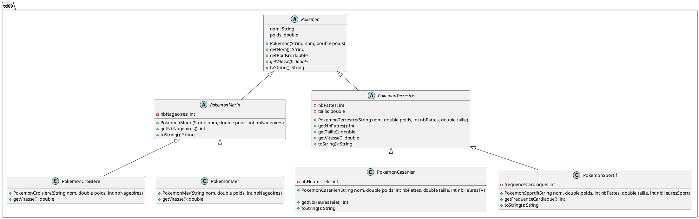

# La correction TD 09

Les classes Pokemon.

```plantuml
@startuml

package td09 {
    abstract class PokemonMarin extends Pokemon {
        - nbNageoires: int
        + PokemonMarin(String nom, double poids, int nbNageoires)
        + getNbNageoires(): int
        + toString(): String
    }

    abstract class PokemonTerrestre extends Pokemon {
        - nbPattes: int
        - taille: double
        + PokemonTerrestre(String nom, double poids, int nbPattes, double taille)
        + getNbPattes(): int
        + getTaille(): double
        + getVitesse(): double
        + toString(): String
    }

    abstract class Pokemon {
        - nom: String
        - poids: double
        + Pokemon(String nom, double poids)
        + getNom(): String
        + getPoids(): double
        + {abstract} getVitesse(): double
        + toString(): String
    }

    class PokemonCasanier extends PokemonTerrestre {
        - nbHeuresTele: int

        + PokemonCasanier(String nom, double poids, int nbPattes, double taille, int nbHeuresTV)

        + getNbHeuresTele(): int
        + toString(): String
    }

    class PokemonSportif extends PokemonTerrestre {
        - frequenceCardiaque: int

        + PokemonSportif(String nom, double poids, int nbPattes, double taille, int nbHeuresSport)
        + getFrequenceCardiaque(): int
        + toString(): String
    }

    class PokemonCroisiere extends PokemonMarin {
        + PokemonCroisiere(String nom, double poids, int nbNageoires)
        + getVitesse(): double
    }

    class PokemonMer extends PokemonMarin {
        + PokemonMer(String nom, double poids, int nbNageoires)
        + getVitesse(): double
    }
}

@enduml
```
